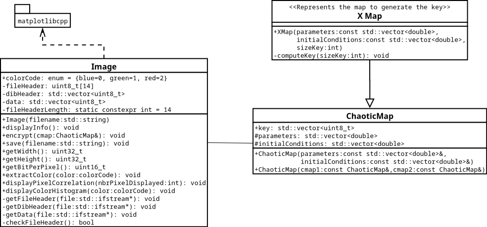

Chaos-based cryptography
========================
> [Link to the initial repository on GitHub](https://github.com/NuxDD/chaos-based_cryptography)

With the recents developments of data transmission, encryption became a real society concern. Traditional encryption algorithm like the Advanced Encryption Standard (AES), aren't suitable to image encryption due to large computational time, or because of the redundancy of the information in the data. This lead us to think that it might exist better algorithm for image encryption. In this paper, we describe a naive implementation for image encryption using chaotic maps. Basic analysis methods, such as visual, intensity and correlation, are used to evaluate the proposed algorithm in regards of image encryption. We finally show that the proposed algorithm, can be a good basis to image encryption.

_Disclaimer : This project provides an introduction to the chaos-based cryptography, the algorithm isn't proved resistant to known crypt-analytical attacks. Be careful with your data._

Code structure
---------------

Dependencies
------------

* At least C++11 is required to compiled the wrapper of the python matplotlib library.
* Since the plotting library is basically a wrapper of a python library, you need to have a working python installation, including development headers (i.e matplotlib, development headers package, tkinter). The library works with python 3.8 but should work with python 2.7 aswell.
* In order to compile the project report, you'll need to have a LaTeX compiler. The simpliest is to install the texlive package.

Example of installation on ArchLinux :

	# pacman -S base-devel python3 python-matplotlib tk texlive-most

Or on Ubuntu :

	# apt-get install python3.8 python3.8-dev python3-tk python3-matplotlib texlive-base

Build
------
**Building the source code :**

The recommended way to build the project is to use CMake as build system as follow :

	$ mkdir build/ && cd build/
	$ cmake ..
	$ make

If you make the choice of a hand-compiled project, be careful to include the python header.

**Compiling the LaTeX report :**

The easiest way to compile the LaTeX report is to be at the root of the directory and run :

	$ ./compileReport.sh

Usage
-----
The program needs to be run as follow :

	$ ./chaos-based_cryptography inputFilename outputFilename

Example, to encrypt the file _grenoble\_city.bmp_ in the input folder, and save it as _encryptedImg.bmp_ in the output folder :

	$ ./chaos-based_cryptography grenoble_city encryptedImg

Todos and issues
-----------------

* Seg fault happens everytime the plot figure are closed (prob. an issue of the lib ?)
* Getters need optimization to reduce exec time

References
-----------

1. The matplotlib C++ wrapper - [github.com/lava/matplotlib-cpp](https://github.com/lava/matplotlib-cpp)
2. Details on the BMP file format - [wikipedia.com/BMP\_file\_format](https://en.wikipedia.org/wiki/BMP_file_format)
